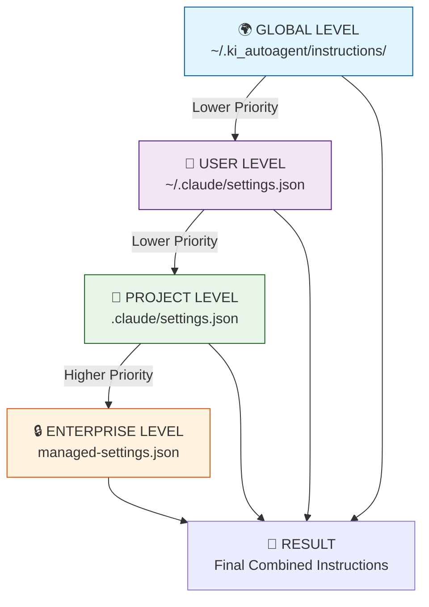
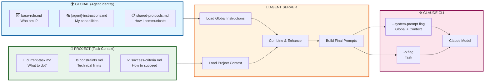
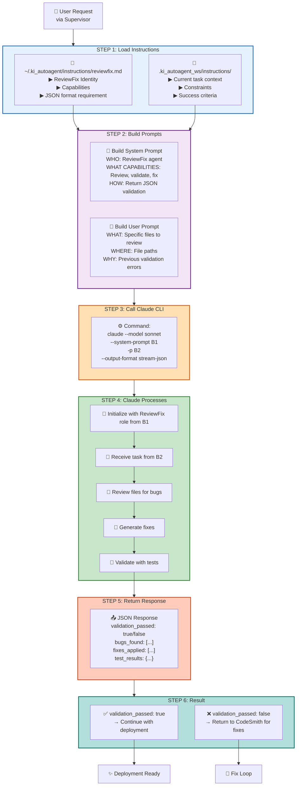
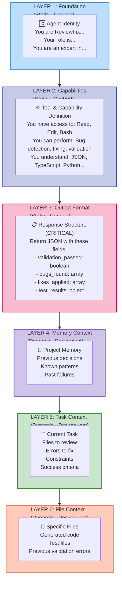
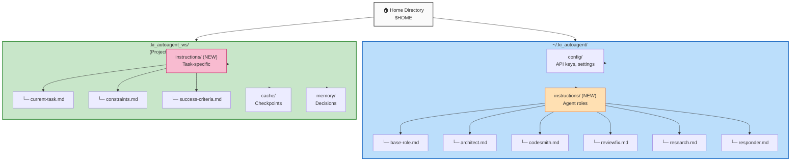
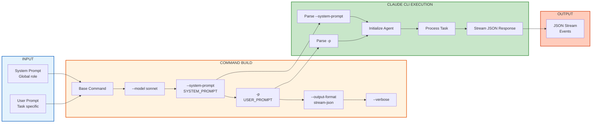
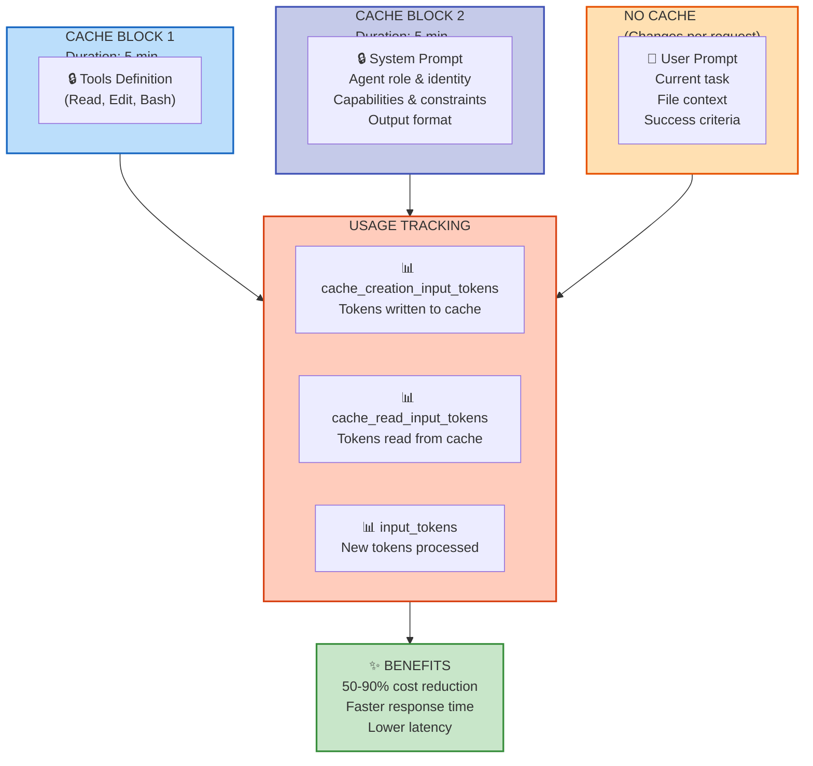
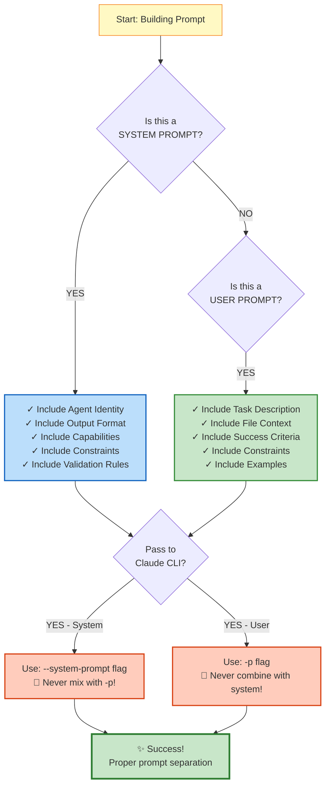

# 🎨 Visual Architecture: Prompt Flow & Instruction Hierarchy

**Version**: 1.0  
**Format**: Mermaid diagrams for understanding the system

---

## 📊 Diagram 1: Instruction Hierarchy (Settings Precedence)

---

## 📊 Diagram 2: Dual-Level Instruction Architecture

---

## 📊 Diagram 3: ReviewFix Agent - Complete Flow

---

## 📊 Diagram 4: Prompt Layering (Depth)

---

## 📊 Diagram 5: File Organization Structure

---

## 📊 Diagram 6: Claude CLI Command Pipeline

---

## 📊 Diagram 7: Prompt Caching Strategy

---

## 🔄 Diagram 8: Comparison - Before vs After

```mermaid
graph TD
    subgraph BEFORE ["❌ BEFORE (Bug)"]
        B1["Input:<br/>system_prompt + user_prompt"]
        B2["Combine:<br/>combined = sys + user"]
        B3["Command:<br/>claude -p combined"]
        B4["Result:<br/>System instructions diluted ⚠️"]
        B5["Output:<br/>validation_passed: always false"]
        B1 --> B2
        B2 --> B3
        B3 --> B4
        B4 --> B5
    end
    
    subgraph AFTER ["✅ AFTER (Fix)"]
        A1["Input:<br/>system_prompt + user_prompt"]
        A2["Separate:<br/>Keep distinct"]
        A3["Command:<br/>claude --system-prompt sys -p user"]
        A4["Result:<br/>Instructions preserved ✅"]
        A5["Output:<br/>validation_passed: correct"]
        A1 --> A2
        A2 --> A3
        A3 --> A4
        A4 --> A5
    end
    
    style BEFORE fill:#ffebee,stroke:#c62828,stroke-width:3px
    style B5 fill:#e53935,color:#fff
    style AFTER fill:#e8f5e9,stroke:#2e7d32,stroke-width:3px
    style A5 fill:#43a047,color:#fff
```

---

## 📋 Quick Reference: Prompt Checklist

---

## 📊 Key Points from Diagrams

### Hierarchy
- Global < User < Project < Enterprise (in Claude Code)
- But in KI AutoAgent: Global Instructions always loaded for agent identity

### Layering
- Foundation (identity) → Capabilities → Format → Context → Task
- Each layer builds on previous
- Enables proper caching at different levels

### File Organization
- Global: `~/.ki_autoagent/instructions/`
- Project: `.ki_autoagent_ws/instructions/`
- Clear separation of concerns

### CLI Usage
- CRITICAL: `--system-prompt` for global instructions
- User prompt goes to `-p` parameter ONLY
- Never combine them!

### Caching
- Static content (identity, format) = cacheable
- Dynamic content (task, files) = not cached
- Enables cost reduction 50-90%

---

## 🎓 Summary

These diagrams illustrate:

1. **Hierarchy** - Where instructions come from
2. **Flow** - How instructions move through the system
3. **Layering** - How prompts are structured
4. **Organization** - Where files are stored
5. **Pipeline** - How CLI is called
6. **Caching** - What gets cached and why
7. **Comparison** - Before/after bug fix
8. **Checklist** - What to include in prompts

Use these as reference when implementing the dual-level instruction architecture!
