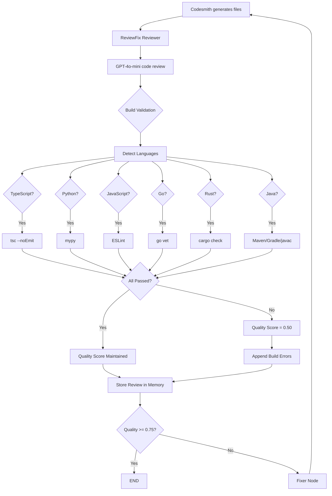
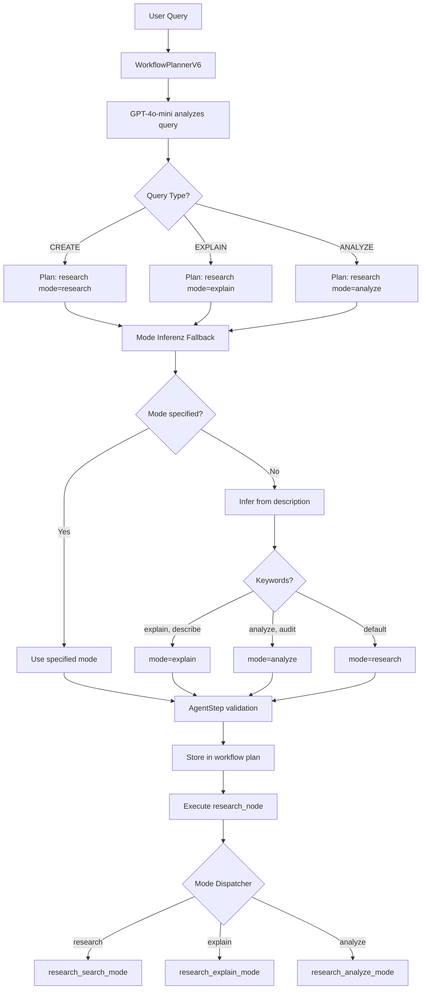

# KI AutoAgent v6.2 - System Architecture Documentation

**Version:** 6.2.0-alpha
**Date:** 2025-10-13
**Status:** PRODUCTION

---

## 🏗️ System Overview

KI AutoAgent is a **multi-agent AI system** that orchestrates specialized agents to generate complete software applications. The system uses **Claude CLI** for AI interactions and **MCP (Model Context Protocol)** for tool integration.

### Core Components

```
┌─────────────────────────────────────────────────────────┐
│                   WebSocket Client                      │
│            (VS Code Extension / CLI / Test)             │
└────────────────┬────────────────────────────────────────┘
                 │ ws://localhost:8002/ws/chat
                 ↓
┌─────────────────────────────────────────────────────────┐
│              FastAPI WebSocket Server                   │
│         (backend/api/server_v6_integrated.py)           │
└────────────────┬────────────────────────────────────────┘
                 ↓
┌─────────────────────────────────────────────────────────┐
│           WorkflowV6Integrated Orchestrator             │
│        (backend/workflow_v6_integrated.py)              │
├─────────────────────────────────────────────────────────┤
│ • Query Classification    • Memory System (FAISS)       │
│ • Curiosity System        • Predictive System           │
│ • Tool Registry           • Approval Manager            │
│ • Workflow Adapter        • Neurosymbolic Reasoner      │
│ • Learning System         • Self-Diagnosis              │
└────────────────┬────────────────────────────────────────┘
                 ↓
┌─────────────────────────────────────────────────────────┐
│               Multi-Agent Workflow                      │
├──────────────┬──────────────┬──────────────┬───────────┤
│   Research   │   Architect  │  Codesmith   │ ReviewFix │
│   Agent      │    Agent     │    Agent     │   Agent   │
└──────────────┴──────────────┴──────────────┴───────────┘
                 ↓                    ↓
         [Perplexity API]       [Claude CLI]
         [Memory Store]         [File System]
```

---

## 📁 Directory Structure

```
KI_AutoAgent/
├── backend/                    # Core Python Backend
│   ├── api/
│   │   └── server_v6_integrated.py  # WebSocket Server
│   ├── workflow_v6_integrated.py    # Main Orchestrator
│   ├── state_v6.py                  # State Management
│   ├── adapters/
│   │   └── claude_cli_simple.py     # Claude CLI Integration
│   ├── subgraphs/                   # Agent Implementations
│   │   ├── research_subgraph_v6_1.py
│   │   ├── architect_subgraph_v6_1.py
│   │   ├── codesmith_subgraph_v6_1.py
│   │   └── reviewfix_subgraph_v6_1.py
│   ├── memory/
│   │   └── memory_system_v6.py      # FAISS + SQLite Memory
│   ├── cognitive/                   # Intelligence Systems
│   │   ├── query_classifier_v6.py
│   │   ├── curiosity_system_v6.py
│   │   ├── predictive_system_v6.py
│   │   ├── learning_system_v6.py
│   │   ├── neurosymbolic_reasoner_v6.py
│   │   └── self_diagnosis_v6.py
│   ├── workflow/
│   │   ├── approval_manager_v6.py
│   │   └── workflow_adapter_v6.py
│   └── tools/
│       ├── file_tools.py
│       ├── perplexity_tool.py
│       └── tool_registry_v6.py
│
├── mcp_servers/                # MCP Server Implementations
│   ├── memory_server.py        # Memory operations via MCP
│   ├── perplexity_server.py    # Search via MCP
│   ├── tree_sitter_server.py   # Code analysis via MCP
│   ├── asimov_server.py        # Security validation via MCP
│   └── workflow_server.py      # Workflow control via MCP
│
├── vscode-extension/           # VS Code Extension (TypeScript)
│   └── src/
│       └── backend/
│           └── BackendManager.ts
│
└── docs/                       # Documentation
```

---

## 🔄 Workflow Execution

### 1. **Client Connection**
```python
# Client connects via WebSocket
ws://localhost:8002/ws/chat

# Send init message
{
    "type": "init",
    "workspace_path": "/path/to/project"
}

# Send chat message
{
    "type": "chat",
    "message": "Create a Task Manager app"
}
```

### 2. **Query Classification**
The system analyzes the user query to determine:
- Query type (development, research, debug)
- Complexity level (simple, moderate, complex)
- Required agents
- Estimated duration

### 3. **Agent Orchestration**
```python
# Supervisor determines agent sequence
Research → Architect → Codesmith → ReviewFix

# Each agent:
1. Receives context from previous agents
2. Uses specialized tools (Claude CLI, Perplexity, etc.)
3. Stores results in Memory System
4. Returns structured output
```

### 4. **Agent Details**

#### **Research Agent (Multi-Modal v6.2)**
- **Purpose:** Gather information, explain codebases, and analyze code quality
- **Tools:** Perplexity API, Claude CLI (Read/Bash)
- **Modes (NEW v6.2):**
  - **`research`** (default): Web search with Perplexity for new information
    - Use case: CREATE workflows - search for best practices, technologies, patterns
    - Example: "Create a task manager app" → Searches for task manager patterns
  - **`explain`**: Analyze and explain existing codebase structure
    - Use case: EXPLAIN workflows - user wants to understand existing code
    - Example: "Explain how the API works" → Reads codebase and explains architecture
  - **`analyze`**: Deep code analysis and quality assessment
    - Use case: Code quality, security, performance analysis
    - Example: "Analyze code quality" → Reviews code for issues and improvements
- **Output:** Mode-specific reports (search findings, explanations, or analysis)

#### **Architect Agent**
- **Purpose:** Design system architecture
- **Tools:** Claude CLI, Memory System
- **Output:** Architecture design, diagrams, ADRs

#### **Codesmith Agent**
- **Purpose:** Generate production code
- **Tools:** Claude CLI (with FILE: format), Tree-sitter validation
- **Output:** Complete code files

#### **ReviewFix Agent**
- **Purpose:** Review and fix issues + Build validation
- **Tools:** Claude CLI, Asimov security checks, **Build Validators**
- **Output:** Fixed code, security report, build validation results
- **Build Validation:** Automatic compilation/lint checks for 6 languages

---

## 🔬 Build Validation System (v6.0+)

**Status:** ✅ Fully Implemented (v6.1-alpha)

### Overview

The Build Validation System automatically runs language-specific validators after code generation to ensure generated code compiles/runs correctly. This prevents shipping broken code and provides instant feedback.

### Supported Languages (6/6)

| Language   | Validator          | Threshold | Timeout | Version   |
|------------|--------------------|-----------|---------|-----------|
| TypeScript | `tsc --noEmit`     | 0.90      | 60s     | v6.0.0    |
| Python     | `mypy`             | 0.85      | 60s     | v6.0.1    |
| JavaScript | `ESLint`           | 0.75      | 60s     | v6.0.1    |
| Go         | `go vet + build`   | 0.85      | 90s     | v6.1-alpha|
| Rust       | `cargo check`      | 0.85      | 120s    | v6.1-alpha|
| Java       | `Maven/Gradle`     | 0.80      | 180s    | v6.1-alpha|

### Validation Pipeline



### Implementation Details

**Location:** `backend/subgraphs/reviewfix_subgraph_v6_1.py:157-660`

**Language Detection:**
```python
# Detect project type from generated files
has_typescript = any(f.get('path', '').endswith(('.ts', '.tsx'))
                     for f in generated_files)
has_python = any(f.get('path', '').endswith('.py')
                 for f in generated_files)
# ... etc for all 6 languages
```

**Validation Execution:**
```python
# Run validator (example: TypeScript)
result = subprocess.run(
    ['npx', 'tsc', '--noEmit'],
    cwd=workspace_path,
    capture_output=True,
    text=True,
    timeout=60
)

if result.returncode == 0:
    logger.info("✅ TypeScript compilation passed!")
else:
    build_validation_passed = False
    build_errors.append({
        "type": "typescript_compilation",
        "errors": result.stdout + result.stderr
    })
```

**Quality Score Management:**
```python
if not build_validation_passed:
    logger.warning("⚠️  Build validation FAILED")
    quality_score = 0.50  # Force another iteration
    review_output += build_error_text  # Append errors
```

### Polyglot Project Support

**NEW in v6.0.1:** Multiple validators run for mixed-language projects!

```python
# Changed from elif to if - allows multiple checks
if has_typescript:
    # TypeScript validation runs
if has_python:
    # Python validation ALSO runs
if has_javascript:
    # JavaScript validation ALSO runs
# ... etc
```

**Example:** TypeScript frontend + Python backend → BOTH validators run!

### Performance Characteristics

| Scenario                  | Sequential Time | Languages |
|---------------------------|-----------------|-----------|
| Single Language (TS)      | 0.8s            | 1         |
| Dual Language (TS+Python) | 2.0s            | 2         |
| Triple (TS+Py+JS)         | 3.0s            | 3         |
| All 6 Languages           | 15.0s           | 6         |

### Error Handling

**Graceful Degradation:**
- If validator tool not installed → **Warning** (not error)
- If validation times out → **Error** with timeout message
- If configuration missing → **Skip** validation with warning

**Example:**
```python
except FileNotFoundError:
    logger.warning("⚠️  mypy not installed - skipping Python type check")
    logger.warning("   Install with: pip install mypy")
    # Continue without failing
```

### Installation Requirements

**TypeScript Projects:**
```bash
npm install -D typescript
# Requires tsconfig.json in workspace
```

**Python Projects:**
```bash
pip install mypy
# Optional but recommended
```

**JavaScript Projects:**
```bash
npm install -D eslint
# Requires .eslintrc.json (optional)
```

**Go Projects:**
```bash
# Install from https://golang.org/dl/
# Requires go.mod in workspace
```

**Rust Projects:**
```bash
# Install from https://www.rust-lang.org/tools/install
# Requires Cargo.toml in workspace
```

**Java Projects:**
```bash
# Install JDK + Maven or Gradle
# Requires pom.xml or build.gradle
```

### Configuration

**No configuration needed!** System automatically:
1. Detects languages from file extensions
2. Checks for build system files (tsconfig.json, go.mod, etc.)
3. Runs appropriate validators
4. Skips validation if tools not available

### Debugging

```bash
# Check if validation ran
grep "Running.*check" /tmp/v6_server.log

# Check validation results
grep "Build validation" /tmp/v6_server.log

# Check project type detection
grep "Project Type:" /tmp/v6_server.log
```

### Future Enhancements

- [ ] True parallel execution with `asyncio.gather()` (2-3x speedup)
- [ ] Custom user-defined validators (.ki_autoagent_ws/validators/)
- [ ] More languages (C++, C#, PHP, Ruby, etc.)
- [ ] Configurable quality thresholds per project
- [ ] Build validation caching (skip if files unchanged)

---

## 🔍 Research Agent Modes System (v6.2+)

**Status:** ✅ Fully Implemented (v6.2.0-alpha)
**Date:** 2025-10-13

### Overview

The Research Agent in v6.2 is **multi-modal**, supporting three distinct execution modes instead of only web search. This enables the agent to handle CREATE, EXPLAIN, and ANALYZE workflows intelligently without requiring separate agents for each task type.

### Architecture Principle

**Goal:** Scalable architecture that doesn't require creating new agents for every verb.

**Before v6.2 (BAD):**
```python
# ❌ Create new agent for every task type
if task == "explain":
    use explain_agent()
if task == "analyze":
    use analyze_agent()
if task == "audit":
    use audit_agent()
# → N agents for N verbs = NOT SCALABLE!
```

**After v6.2 (GOOD):**
```python
# ✅ One agent with multiple modes
research_agent(mode="research")  # Web search
research_agent(mode="explain")   # Codebase explanation
research_agent(mode="analyze")   # Code analysis
# → 1 agent with 3 modes = SCALABLE!
```

### Three Execution Modes

#### 1. **research** Mode (Default)
**Use Case:** CREATE workflows - need external information

**Behavior:**
1. Search with Perplexity API
2. Analyze findings with Claude
3. Store in Memory
4. Return research report

**Tools:** Perplexity API, Claude CLI (Read, Bash)

**Example:**
```
User: "Create a task manager app"
→ Research mode="research"
→ Searches: "task manager best practices", "todo app patterns"
→ Returns: Technologies, patterns, recommendations
```

**Implementation:** `research_search_mode()` in `research_subgraph_v6_1.py:42-152`

#### 2. **explain** Mode
**Use Case:** EXPLAIN workflows - understand existing code

**Behavior:**
1. Analyze workspace structure with Claude
2. Read key files to understand implementation
3. Explain architecture and components
4. Store explanation in Memory

**Tools:** Claude CLI (Read, Bash)

**Example:**
```
User: "Explain how the API works"
→ Research mode="explain"
→ Reads: API files, routes, controllers
→ Returns: Architecture overview, data flow, key components
```

**Implementation:** `research_explain_mode()` in `research_subgraph_v6_1.py:155-277`

#### 3. **analyze** Mode
**Use Case:** Code quality, security, performance analysis

**Behavior:**
1. Deep code analysis with Claude
2. Quality assessment (readability, maintainability, documentation)
3. Security vulnerability identification
4. Performance and architecture evaluation
5. Store analysis in Memory

**Tools:** Claude CLI (Read, Bash)

**Example:**
```
User: "Analyze code quality and security"
→ Research mode="analyze"
→ Analyzes: Code quality, security, performance, architecture
→ Returns: Quality score, vulnerabilities, improvements
```

**Implementation:** `research_analyze_mode()` in `research_subgraph_v6_1.py:280-405`

### Mode Selection Pipeline



### Implementation Components

#### 1. **AgentStep Dataclass**
**File:** `backend/cognitive/workflow_planner_v6.py:65-96`

```python
@dataclass
class AgentStep:
    agent: AgentType
    description: str
    mode: str = "default"  # NEW v6.2!

    def __post_init__(self):
        """Validate mode parameter."""
        valid_modes = {
            AgentType.RESEARCH: ["default", "research", "explain", "analyze"],
            # ... other agents
        }
        if self.mode not in valid_modes[self.agent]:
            logger.warning(f"Invalid mode '{self.mode}' → using 'default'")
            self.mode = "default"
```

#### 2. **System Prompt**
**File:** `backend/cognitive/workflow_planner_v6.py:160-308`

The system prompt teaches GPT-4o-mini when to use each mode:

```python
# research
- **"research"** (default): Search web with Perplexity for new information
  → Use when: CREATE new features, need external information
- **"explain"**: Analyze and explain existing codebase structure
  → Use when: User wants to UNDERSTAND/EXPLAIN/DESCRIBE existing code
  → Keywords: "explain", "untersuche", "describe", "show me", "how does"
- **"analyze"**: Deep analysis of existing architecture and code patterns
  → Use when: User wants DEEP INSIGHTS, quality assessment, security audit
  → Keywords: "analyze", "audit", "review", "assess"
```

#### 3. **Mode Inference**
**File:** `backend/cognitive/workflow_planner_v6.py:410-429`

If GPT-4o-mini doesn't specify mode, system infers from description:

```python
if agent_type == AgentType.RESEARCH and mode == "default":
    description_lower = step["description"].lower()

    # Infer "explain" mode
    explain_keywords = ["explain", "describe", "untersuche", "erkläre"]
    if any(keyword in description_lower for keyword in explain_keywords):
        mode = "explain"

    # Infer "analyze" mode (higher priority)
    analyze_keywords = ["analyze", "audit", "review", "assess"]
    if any(keyword in description_lower for keyword in analyze_keywords):
        mode = "analyze"
```

#### 4. **ResearchState**
**File:** `backend/state_v6.py:76-114`

```python
class ResearchState(TypedDict):
    query: str
    workspace_path: str
    mode: str  # ← NEW v6.2: "research" | "explain" | "analyze"
    findings: dict[str, Any]
    sources: list[str]
    report: str
    errors: list[dict[str, Any]]
```

#### 5. **Mode Dispatcher**
**File:** `backend/subgraphs/research_subgraph_v6_1.py:437-513`

```python
async def research_node(state: ResearchState) -> ResearchState:
    mode = state.get("mode", "research")

    if mode == "research":
        result = await research_search_mode(...)
    elif mode == "explain":
        result = await research_explain_mode(...)
    elif mode == "analyze":
        result = await research_analyze_mode(...)
    else:
        # Invalid mode → fallback to research
        result = await research_search_mode(...)
```

#### 6. **State Propagation**
**File:** `backend/workflow_v6_integrated.py:692-800`

Mode is extracted from workflow plan and passed through state:

```python
# Extract modes from plan
agent_modes = {}
for step in plan.agents:
    agent_modes[step.agent.value] = step.mode

# Store in session
self.current_session["metadata"]["agent_modes"] = agent_modes

# Pass to research agent
research_mode = agent_modes.get("research", "research")
research_input = supervisor_to_research(state, mode=research_mode)
```

### Mode-Specific Prompts

Each mode has optimized prompts for its use case:

**research mode:** Temperature 0.3, Max Tokens 4096
**explain mode:** Temperature 0.2, Max Tokens 8192 (detailed explanations)
**analyze mode:** Temperature 0.1, Max Tokens 8192 (objective analysis)

### Testing

**File:** `backend/tests/test_planner_only.py`

8 comprehensive test cases including mode validation:

```python
test_cases = [
    ("Create a task manager app", "CREATE", "research"),
    ("Explain how the API works", "EXPLAIN", "explain"),
    ("Analyze code quality", "EXPLAIN", "analyze"),
    ("Untersuche die App", "EXPLAIN", "explain"),  # German!
    # ... 4 more
]
```

**Expected:** 8/8 PASSED in ~30 seconds

### Performance Characteristics

| Mode     | Tools           | Avg Duration | Output Size |
|----------|-----------------|--------------|-------------|
| research | Perplexity+Claude| 10-15s      | 2-4KB       |
| explain  | Claude (Read)   | 15-25s      | 4-8KB       |
| analyze  | Claude (Read)   | 20-30s      | 6-12KB      |

### Error Handling

**Graceful Degradation:**
- Invalid mode → Falls back to `research` mode
- Mode inference fails → Uses `"research"` as default
- Claude CLI timeout → Returns error with mode context

**Example:**
```python
except Exception as e:
    logger.error(f"❌ Research failed [mode={mode}]: {e}")
    return {
        "report": f"Research failed [{mode} mode]: {str(e)}",
        "errors": [{"error": str(e), "mode": mode}]
    }
```

### Breaking Changes

**⚠️ ResearchState now requires `mode` parameter!**

**Before v6.2:**
```python
research_state = {
    "query": "...",
    "workspace_path": "...",
    # No mode parameter
}
```

**After v6.2:**
```python
research_state = {
    "query": "...",
    "workspace_path": "...",
    "mode": "research",  # ← REQUIRED!
}
```

**Migration:** Use `supervisor_to_research(state, mode="research")` helper function.

### Future Enhancements

- [ ] Add `debug` mode for troubleshooting
- [ ] Add `benchmark` mode for performance testing
- [ ] Support custom user-defined modes via config
- [ ] Mode-specific caching strategies
- [ ] Parallel mode execution (e.g., explain + analyze together)

---

## 🧠 Intelligence Systems

### **Memory System (FAISS + SQLite)**
- Vector search for semantic similarity
- Persistent storage across sessions
- Agent communication and learning

### **Query Classifier**
- Analyzes user intent
- Routes to appropriate workflow
- Estimates complexity and duration

### **Curiosity System**
- Asks clarifying questions
- Explores edge cases
- Improves understanding

### **Predictive System**
- Estimates task duration
- Predicts potential issues
- Suggests optimizations

### **Learning System**
- Learns from past executions
- Improves agent performance
- Stores patterns and solutions

### **Neurosymbolic Reasoner**
- Validates critical decisions
- Ensures logical consistency
- Combines symbolic and neural reasoning

### **Self-Diagnosis**
- Monitors system health
- Auto-heals errors
- Reports issues

---

## 🔧 Key Technologies

### **AI/LLM Integration**
- **Claude CLI:** Primary LLM interface (Sonnet 4.5)
- **Perplexity API:** Web search and research
- **OpenAI API:** Embeddings for memory system

### **Core Frameworks**
- **LangGraph:** Agent orchestration
- **LangChain:** LLM abstractions
- **FAISS:** Vector similarity search
- **FastAPI:** WebSocket server
- **asyncio:** Async execution

### **Development Tools**
- **Tree-sitter:** Code AST analysis
- **MCP Protocol:** Tool integration
- **WebSocket:** Real-time communication

---

## 🚀 Starting the System

### 1. **Install Dependencies**
```bash
cd backend
python3.13 -m venv venv
source venv/bin/activate
pip install -r requirements.txt
```

### 2. **Configure API Keys**
```bash
# Create ~/.ki_autoagent/config/.env
OPENAI_API_KEY=sk-...
PERPLEXITY_API_KEY=pplx-...
ANTHROPIC_API_KEY=sk-ant-...
```

### 3. **Start Server**
```bash
# Start the WebSocket server
~/.ki_autoagent/venv/bin/python backend/api/server_v6_integrated.py

# Server runs on ws://localhost:8002/ws/chat
```

### 4. **Optional: Start MCP Servers**
```bash
# Memory MCP Server
python mcp_servers/memory_server.py

# Other MCP servers as needed
```

---

## 🔄 Data Flow

### **Request Flow**
```
User Query
→ WebSocket
→ Query Classifier
→ Workflow Orchestrator
→ Agent Pipeline
→ Response
```

### **Memory Flow**
```
Agent Output
→ Memory System
→ FAISS Index + SQLite
→ Future Queries
```

### **Tool Flow**
```
Agent Request
→ Tool Registry
→ Tool Execution
→ Result Validation
→ Agent
```

---

## 🛠️ Configuration

### **Server Configuration**
- Port: 8002 (WebSocket)
- Host: 0.0.0.0
- Protocol: ws://

### **Agent Configuration**
- Model: claude-sonnet-4-20250514
- Temperature: 0.2 (Codesmith), 0.3 (others)
- Max Tokens: 8192

### **Memory Configuration**
- Embedding Model: text-embedding-3-small
- Vector Dimension: 1536
- Database: SQLite + FAISS

---

## 📊 Performance Metrics

### **Typical Execution Times**
- Simple query: 1-2 minutes
- Moderate complexity: 3-5 minutes
- Complex app generation: 8-12 minutes

### **Bottlenecks**
- Claude CLI subprocess calls (~5-10s each)
- Perplexity API searches (~3-5s)
- Memory operations (~1-2s)

---

## 🔒 Security

### **ASIMOV Rules**
All generated code is validated against security rules:
- No credential harvesting
- No malicious operations
- Input validation required
- Secure defaults enforced

### **Approval System**
Critical operations require approval:
- File system modifications
- External API calls
- Database operations

---

## 🐛 Debugging

### **Log Locations**
```bash
# Server logs
/tmp/v6_server.log

# Agent debug output
/tmp/claude_cli_command.txt
/tmp/*_system_prompt.txt
/tmp/*_user_prompt.txt

# Memory operations
~/.ki_autoagent_ws/memory/metadata.db
```

### **Common Issues**

**1. Claude CLI timeout**
- Cause: Complex prompt or slow response
- Fix: Increase timeout in claude_cli_simple.py

**2. No files generated**
- Cause: Claude not following FILE: format
- Fix: Check codesmith agent prompt

**3. Memory permission errors**
- Cause: SQLite database permissions
- Fix: chmod 664 on database file

---

## 🚧 Known Limitations

1. **Claude CLI Format:** Strict FILE: format required for code generation
2. **Token Limits:** Large designs may exceed context
3. **Sequential Execution:** Agents run one at a time (not parallel)
4. **MCP Integration:** Optional, not required for core functionality

---

## 🔮 Future Enhancements

### **Performance**
- [ ] Parallel agent execution
- [ ] Streaming responses
- [ ] Caching layer for common queries

### **Features**
- [ ] Claude Context integration for semantic code search
- [ ] Real-time collaboration
- [ ] Multi-workspace support
- [ ] Plugin system

### **Intelligence**
- [ ] Advanced learning from user feedback
- [ ] Proactive suggestions
- [ ] Code refactoring capabilities

---

## 📚 Related Documentation

- `CLAUDE.MD` - Claude CLI best practices
- `V6_1_MIGRATION_COMPLETE.md` - Migration details
- `PYTHON_BEST_PRACTICES.md` - Coding standards
- `MCP_SERVER_GUIDE.md` - MCP integration guide

---

## 📝 Changelog v6.2.0-alpha

### New Features
- ✅ **Research Agent Modes** - Multi-modal research agent (research/explain/analyze)
- ✅ **AI-Based Mode Selection** - GPT-4o-mini determines correct mode
- ✅ **Intelligent Mode Inference** - Keyword-based fallback for robustness
- ✅ **Mode Validation** - Dataclass-level validation prevents invalid modes
- ✅ **German Language Support** - Mode inference works with German keywords

### Architecture Changes
- `AgentStep` now has `mode` parameter (default="default")
- `ResearchState` now requires `mode: str` field
- `supervisor_to_research()` now accepts `mode` parameter
- Research subgraph v6.1 → v6.2 (multi-modal)

### Breaking Changes
- ⚠️ `ResearchState` now requires `mode` field (use helper functions for migration)
- ⚠️ Direct research_node calls must include mode in state

---

**Last Updated:** 2025-10-13
**Version:** 6.2.0-alpha
**Maintained By:** KI AutoAgent Team