## 🔍 System-Analyse Report

### 📊 Code-Index Status
- **151** Files vollständig indiziert
- **1104** Functions analysiert
- **170** Classes dokumentiert
- **25** API Endpoints gefunden
- **52008** Lines of Code

### 🏗️ Architecture Overview

```mermaid
graph TB
    subgraph "KI AutoAgent System"
        subgraph "Frontend Layer"
            VSCode[["📝 VS Code Extension<br/>TypeScript"]]
            WebView[["💬 Chat WebView<br/>HTML/JS"]]
        end

        subgraph "Backend Layer"
            API[["🌐 FastAPI Server<br/>Python - Port 8000"]]
            WS[["🔌 WebSocket Handler<br/>Real-time Communication"]]
        end

        subgraph "Agent Layer"
            Orchestrator[["🎭 Orchestrator Agent<br/>Task Routing"]]
            Architect[["🏗️ Architect Agent<br/>System Design"]]
            CodeSmith[["⚒️ CodeSmith Agent<br/>Code Generation"]]
            Other[["🤖 Other Agents<br/>(7 more)"]]
        end

        subgraph "Core Services"
            Memory[["🧠 Memory Manager<br/>Vector Storage"]]
            Workflow[["⚙️ Workflow Engine<br/>Task Execution"]]
            Context[["📊 Shared Context<br/>Agent Communication"]]
        end

        VSCode --> WebView
        WebView -->|WebSocket| WS
        WS --> API
        API --> Orchestrator
        Orchestrator --> Architect
        Orchestrator --> CodeSmith
        Orchestrator --> Other

        Architect --> Memory
        CodeSmith --> Memory
        Other --> Memory

        Architect --> Context
        CodeSmith --> Context
        Other --> Context

        Orchestrator --> Workflow
    end

    classDef frontendStyle fill:#e8f5e9,stroke:#4caf50,stroke-width:2px
    classDef backendStyle fill:#e3f2fd,stroke:#2196f3,stroke-width:2px
    classDef agentStyle fill:#f3e5f5,stroke:#9c27b0,stroke-width:2px
    classDef coreStyle fill:#fff3e0,stroke:#ff9800,stroke-width:2px

    class VSCode,WebView frontendStyle
    class API,WS backendStyle
    class Orchestrator,Architect,CodeSmith,Other agentStyle
    class Memory,Workflow,Context coreStyle
    API -->|22 endpoints| API
```


### 🔒 Security Analysis
- 🔴 **2 High** risk vulnerabilities
- 🟡 **10 Medium** risk issues

### 📈 Performance Metrics
- **Average Complexity**: 4.4
- **Maintainability Index**: 34.6
- **Quality Score**: 60.5/100

### 🧹 Dead Code: **1391** unused items found

### 🚀 Konkrete Verbesserungen (Priorisiert)

#### 1. Enable Parallel Agent Execution in Orchestrator [HIGH]
**Problem**: Agents execute sequentially even when they could run in parallel
**Lösung**: Modify orchestrator to detect independent subtasks and run agents concurrently
```python
# In orchestrator_agent_v2.py
# Execute independent subtasks in parallel:
if workflow_type == "parallel":
    tasks = [agent.execute(subtask) for subtask in independent_subtasks]
    results = await asyncio.gather(*tasks)

```
**Impact**: 3-5x faster for multi-agent workflows like infrastructure analysis

#### 2. Fix Stop Button Functionality [CRITICAL]
**Problem**: Stop button doesn't properly cancel running agent tasks
**Lösung**: Integrate CancelToken system with WebSocket stop handler
```python
# In server.py WebSocket handler:
if message_type == "stop":
    if client_id in active_tasks:
        active_tasks[client_id].cancel()
    await manager.send_json(client_id, {"type": "stopped"})

```
**Impact**: Users can interrupt long-running tasks, better UX

#### 3. Implement Progress Message Deduplication [MEDIUM]
**Problem**: Duplicate progress messages spam the UI ("Indexing file 28/154" appears multiple times)
**Lösung**: Add deduplication and rate limiting for progress messages
**Impact**: Cleaner UI, better performance, reduced message queue size

#### 4. Remove 1391 Dead Code Items [MEDIUM]
**Problem**: Unused functions and variables clutter the codebase
**Lösung**: Automated dead code removal with vulture
**Impact**: Smaller codebase, faster parsing, better maintainability

#### 5. Optimize Agent Memory Usage [HIGH]
**Problem**: system_analysis.json is 14GB - being loaded into memory repeatedly
**Lösung**: Stream large files instead of loading entirely, use chunked processing
**Impact**: Reduce memory usage by 90%, prevent OOM errors

### 📊 Dependency Graph

