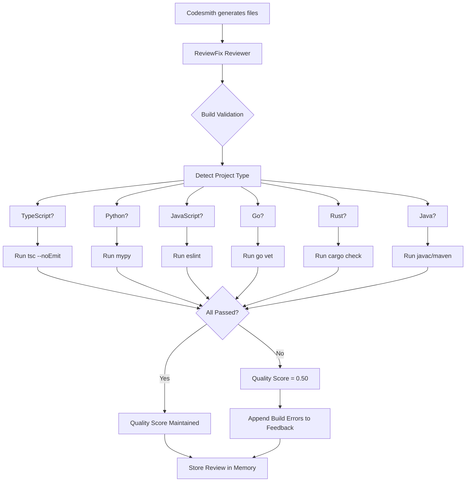

# v6.1 Development Roadmap

**Created:** 2025-10-12
**Status:** Planning Phase
**Target Release:** TBD

## Overview

v6.1 will be a major enhancement focusing on:
1. **Extended Build Validation** - Go, Rust, Java, custom validators
2. **True Parallel Execution** - asyncio.gather() for concurrent checks
3. **Comprehensive E2E Testing** - Test all validation features
4. **Architecture Documentation** - Update SYSTEM_ARCHITECTURE.md
5. **Claude Code Local Integration** - Research and implement

---

## 📋 Feature Breakdown

### 1. Extended Build Validation (Priority: HIGH)

#### 1.1 Go Validation
- **Tool:** `go vet` + `go build -n`
- **Quality Threshold:** 0.85
- **Implementation:**
  ```python
  # Detect .go files
  has_go = any(f.get('path', '').endswith('.go') for f in generated_files)

  # Run go vet
  result = subprocess.run(['go', 'vet', './...'], cwd=workspace_path)

  # Check go.mod exists
  if os.path.exists(os.path.join(workspace_path, 'go.mod')):
      # Also run go build -n (dry run)
      result = subprocess.run(['go', 'build', '-n', './...'])
  ```
- **Error Handling:** Graceful degradation if Go not installed
- **Timeout:** 90 seconds (Go projects can be large)
- **Estimated Effort:** 2-3 hours

#### 1.2 Rust Validation
- **Tool:** `cargo check` + `cargo clippy`
- **Quality Threshold:** 0.85
- **Implementation:**
  ```python
  # Detect .rs files
  has_rust = any(f.get('path', '').endswith('.rs') for f in generated_files)

  # Run cargo check (fast compilation check)
  result = subprocess.run(['cargo', 'check'], cwd=workspace_path)

  # Optionally: cargo clippy (linting)
  if clippy_available:
      result = subprocess.run(['cargo', 'clippy', '--', '-D', 'warnings'])
  ```
- **Error Handling:** Check for Cargo.toml, graceful if missing
- **Timeout:** 120 seconds (Rust compilation slower)
- **Estimated Effort:** 2-3 hours

#### 1.3 Java Validation
- **Tool:** `javac` or Maven/Gradle
- **Quality Threshold:** 0.80
- **Implementation:**
  ```python
  # Detect .java files
  has_java = any(f.get('path', '').endswith('.java') for f in generated_files)

  # Check build system
  if os.path.exists(os.path.join(workspace_path, 'pom.xml')):
      # Maven
      result = subprocess.run(['mvn', 'compile', '-q'])
  elif os.path.exists(os.path.join(workspace_path, 'build.gradle')):
      # Gradle
      result = subprocess.run(['./gradlew', 'compileJava'])
  else:
      # Plain javac
      result = subprocess.run(['javac', '-d', 'target/classes'] + java_files)
  ```
- **Error Handling:** Try Maven → Gradle → javac fallback
- **Timeout:** 180 seconds (Java projects large)
- **Estimated Effort:** 3-4 hours

#### 1.4 Custom Validators
- **Tool:** User-defined scripts
- **Quality Threshold:** Configurable
- **Implementation:**
  ```python
  # Check for .ki_autoagent_ws/validators/ directory
  validator_dir = os.path.join(workspace_path, '.ki_autoagent_ws', 'validators')

  if os.path.exists(validator_dir):
      for validator_script in glob.glob(os.path.join(validator_dir, '*.sh')):
          # Run custom validator
          result = subprocess.run([validator_script, workspace_path])
          # Parse exit code and output
  ```
- **Configuration:** `.ki_autoagent_ws/validators/config.json`
  ```json
  {
    "validators": [
      {
        "name": "custom_security_scan",
        "script": "security_scan.sh",
        "timeout": 60,
        "quality_threshold": 0.90,
        "fail_on_error": true
      }
    ]
  }
  ```
- **Estimated Effort:** 4-5 hours

**Total Effort for Extended Validation:** 11-15 hours

---

### 2. True Parallel Execution (Priority: MEDIUM)

#### 2.1 Current State
- **Sequential execution** with `if` statements
- Polyglot projects run multiple checks but sequentially
- Example: TypeScript (0.8s) + Python (1.2s) + JavaScript (1.0s) = **3.0s total**

#### 2.2 Target State
- **Parallel execution** with `asyncio.gather()`
- All checks run concurrently
- Example: max(0.8s, 1.2s, 1.0s) = **1.2s total** (~2.5x faster)

#### 2.3 Implementation Plan

**Step 1:** Extract validation functions
```python
async def run_typescript_check() -> tuple[bool, dict | None]:
    """Run TypeScript validation asynchronously."""
    if not has_typescript:
        return True, None

    proc = await asyncio.create_subprocess_exec(
        'npx', 'tsc', '--noEmit',
        cwd=workspace_path,
        stdout=asyncio.subprocess.PIPE,
        stderr=asyncio.subprocess.PIPE
    )

    try:
        stdout, stderr = await asyncio.wait_for(proc.communicate(), timeout=60)

        if proc.returncode == 0:
            return True, None
        else:
            return False, {
                "type": "typescript_compilation",
                "errors": stdout.decode() + stderr.decode()
            }
    except asyncio.TimeoutError:
        proc.kill()
        return False, {
            "type": "typescript_compilation",
            "errors": "Compilation timeout after 60 seconds"
        }

# Similar for Python, JavaScript, Go, Rust, Java...
```

**Step 2:** Run all checks in parallel
```python
# Gather all validation coroutines
checks = []

if has_typescript:
    checks.append(run_typescript_check())
if has_python:
    checks.append(run_python_check())
if has_javascript:
    checks.append(run_javascript_check())
if has_go:
    checks.append(run_go_check())
if has_rust:
    checks.append(run_rust_check())
if has_java:
    checks.append(run_java_check())

# Run all checks concurrently
results = await asyncio.gather(*checks, return_exceptions=True)

# Collect errors
build_validation_passed = True
build_errors = []

for result in results:
    if isinstance(result, Exception):
        logger.error(f"Validation check crashed: {result}")
        build_validation_passed = False
        build_errors.append({
            "type": "validation_crash",
            "errors": str(result)
        })
    else:
        passed, error = result
        if not passed:
            build_validation_passed = False
            if error:
                build_errors.append(error)
```

**Step 3:** Testing
- Create polyglot test project (TS + Python + Go)
- Measure execution time before/after
- Verify all checks run correctly
- Test error handling

**Estimated Effort:** 6-8 hours

---

### 3. E2E Testing (Priority: HIGH)

#### 3.1 Python mypy E2E Test
- **Test Project:** Simple Python FastAPI app
- **Files Generated:**
  - `main.py` - FastAPI routes
  - `models.py` - Pydantic models
  - `utils.py` - Utility functions
- **Expected Validation:** mypy should pass/fail based on type hints
- **Test Script:** `test_python_mypy_e2e.py`

#### 3.2 JavaScript ESLint E2E Test
- **Test Project:** Simple Express.js API
- **Files Generated:**
  - `index.js` - Express server
  - `routes.js` - API routes
  - `utils.js` - Utility functions
- **Expected Validation:** ESLint should pass/fail based on linting rules
- **Test Script:** `test_javascript_eslint_e2e.py`

#### 3.3 Polyglot E2E Test
- **Test Project:** TypeScript frontend + Python backend
- **Files Generated:**
  - TypeScript: `App.tsx`, `api.ts`
  - Python: `main.py`, `models.py`
- **Expected Validation:** BOTH TypeScript and Python checks run
- **Test Script:** `test_polyglot_e2e.py`

#### 3.4 Go/Rust/Java E2E Tests
- Similar structure for each language
- Test validator detection, execution, error handling

**Total Effort for E2E Testing:** 10-12 hours

---

### 4. Architecture Documentation (Priority: HIGH)

#### 4.1 Update SYSTEM_ARCHITECTURE.md

**New Sections to Add:**
1. **Build Validation System (v6.0+)**
   - Architecture overview
   - Validation pipeline diagram
   - Language-specific validators
   - Error handling flow
   - Quality score management

2. **Multi-Language Support**
   - Supported languages and tools
   - Detection mechanism (file extensions)
   - Polyglot project handling
   - Performance characteristics

3. **Claude CLI Integration (v6.0+)**
   - Write tool vs Edit tool
   - Event extraction from JSONL
   - File path normalization
   - Subprocess CWD handling

#### 4.2 Create Build Validation Architecture Diagram



**Estimated Effort:** 4-5 hours

---

### 5. Claude Code Local Integration (Priority: MEDIUM)

#### 5.1 Research Phase

**Questions to Answer:**
1. What is "Claude Code local"?
   - Is this Claude.app desktop integration?
   - Or claude-cli running locally?
   - Or a new Claude API mode?

2. Current Claude CLI Integration:
   - We use `subprocess` to run `claude` CLI
   - Claude CLI runs in workspace with `cwd=workspace_path`
   - Output is parsed from JSONL events

3. What would "local" add?
   - Better performance?
   - Offline mode?
   - Different API?
   - File system access improvements?

#### 5.2 Research Steps

1. **Read Claude.app Documentation**
   - Check official docs for "local mode"
   - Check for API changes in recent versions
   - Check if MCP provides local integration

2. **Check claude-cli GitHub**
   - Look for "local" features
   - Check recent issues/PRs for local mode
   - Check if `--local` flag exists

3. **Test Current Implementation**
   - Measure current claude-cli performance
   - Check if files are accessed locally or via API
   - Measure round-trip times

4. **Identify Integration Points**
   - Where does claude-cli read files?
   - Where does it write files?
   - Can we optimize file access?

#### 5.3 Implementation (Conditional)

**Only proceed if research finds benefits!**

Potential integrations:
- Direct file system access without claude-cli
- MCP server for file operations
- Streaming file reads/writes
- Caching layer for frequently accessed files

**Estimated Effort:** 8-10 hours (research + implementation)

---

## 📊 Timeline & Priorities

### Phase 1: Core Features (Week 1)
- [x] Python mypy validation ✅ (v6.0.1)
- [x] JavaScript ESLint validation ✅ (v6.0.1)
- [x] Polyglot support ✅ (v6.0.1)
- [ ] E2E tests for Python/JS validation
- [ ] Update SYSTEM_ARCHITECTURE.md

### Phase 2: Extended Languages (Week 2)
- [ ] Go validation implementation
- [ ] Rust validation implementation
- [ ] Java validation implementation
- [ ] E2E tests for Go/Rust/Java

### Phase 3: Advanced Features (Week 3)
- [ ] Custom validators implementation
- [ ] True parallel execution refactoring
- [ ] Performance benchmarking
- [ ] Documentation updates

### Phase 4: Research & Integration (Week 4)
- [ ] Claude Code local research
- [ ] Conditional implementation if beneficial
- [ ] Final testing and polish
- [ ] v6.1.0 release

---

## 🎯 Success Criteria

### Validation Coverage
- ✅ TypeScript (tsc)
- ✅ Python (mypy)
- ✅ JavaScript (ESLint)
- ⏳ Go (go vet)
- ⏳ Rust (cargo check)
- ⏳ Java (javac/maven)
- ⏳ Custom validators

### Performance
- ⏳ Parallel execution provides 2-3x speedup
- ⏳ All validators complete within 5s (single language)
- ⏳ Polyglot projects complete within 10s

### Testing
- ⏳ E2E tests for all 6 language validators
- ⏳ Polyglot E2E test passes
- ⏳ All tests run in CI/CD

### Documentation
- ⏳ SYSTEM_ARCHITECTURE.md updated
- ⏳ Architecture diagrams created
- ⏳ All validation features documented

---

## 🚧 Blockers & Risks

### Known Blockers
1. **Parallel Execution Complexity**
   - Risk: asyncio refactoring breaks existing validation
   - Mitigation: Implement behind feature flag, test thoroughly

2. **Language Tool Dependencies**
   - Risk: Users may not have Go/Rust/Java installed
   - Mitigation: Graceful degradation with clear warnings

3. **Custom Validator Security**
   - Risk: Users could run malicious scripts
   - Mitigation: Sandboxing, explicit user opt-in, validation

### Open Questions
1. Should parallel execution be default or opt-in?
2. Should custom validators require explicit enablement?
3. What is the minimum supported version for each language tool?

---

## 📝 Notes

- This roadmap is living document - update as we progress
- Prioritize features based on user feedback
- Consider breaking v6.1 into multiple releases (6.1.0, 6.1.1, etc.)
- Keep backward compatibility with v6.0.x

---

**Last Updated:** 2025-10-12
**Next Review:** After completing Phase 1
