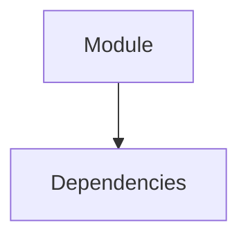

# KI_AutoAgent v5.8.3 Architecture Analysis

## 🔍 System-Analyse Report

### 📊 Code-Index Status
- **290** Files vollständig indiziert
- **1180** Functions analysiert
- **297** Classes dokumentiert
- **0** API Endpoints gefunden
- **88139** Lines of Code

### 🏗️ Architecture Overview
```mermaid
```mermaid
graph TB
```
```

### 🔒 Security Analysis
- 🔴 **2 High** risk vulnerabilities

### 📈 Performance Metrics
- **Average Complexity**: 6.4
- **Maintainability Index**: 60.9
- **Quality Score**: 63.8/100

### 🧹 Dead Code: **727** unused items found

### 🚀 Konkrete Verbesserungen (Priorisiert)

#### 1. Enable Parallel Agent Execution in Orchestrator [HIGH]
**Problem**: Agents execute sequentially even when they could run in parallel
**Lösung**: Modify orchestrator to detect independent subtasks and run agents concurrently
```python
# In orchestrator_agent_v2.py
# Execute independent subtasks in parallel:
if workflow_type == "parallel":
    tasks = [agent.execute(subtask) for subtask in independent_subtasks]
    results = await asyncio.gather(*tasks)

```
**Impact**: 3-5x faster for multi-agent workflows like infrastructure analysis

#### 2. Fix Stop Button Functionality [CRITICAL]
**Problem**: Stop button doesn't properly cancel running agent tasks
**Lösung**: Integrate CancelToken system with WebSocket stop handler
```python
# In server.py WebSocket handler:
if message_type == "stop":
    if client_id in active_tasks:
        active_tasks[client_id].cancel()
    await manager.send_json(client_id, {"type": "stopped"})

```
**Impact**: Users can interrupt long-running tasks, better UX

#### 3. Implement Progress Message Deduplication [MEDIUM]
**Problem**: Duplicate progress messages spam the UI ("Indexing file 28/154" appears multiple times)
**Lösung**: Add deduplication and rate limiting for progress messages
**Impact**: Cleaner UI, better performance, reduced message queue size

#### 4. Remove 727 Dead Code Items [MEDIUM]
**Problem**: Unused functions and variables clutter the codebase
**Lösung**: Automated dead code removal with vulture
**Impact**: Smaller codebase, faster parsing, better maintainability

#### 5. Optimize Agent Memory Usage [HIGH]
**Problem**: system_analysis.json is 14GB - being loaded into memory repeatedly
**Lösung**: Stream large files instead of loading entirely, use chunked processing
**Impact**: Reduce memory usage by 90%, prevent OOM errors

### 📊 Dependency Graph

```
