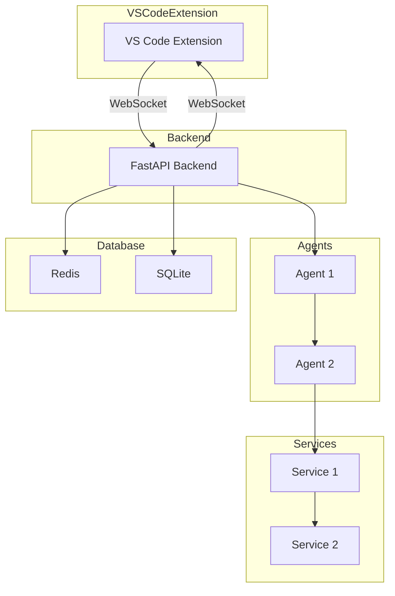
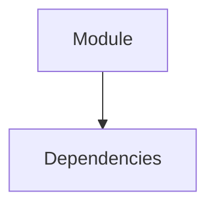

## 🔍 System-Analyse Report

### 📊 Code-Index Status
- **0** Files vollständig indiziert
- **0** Functions analysiert
- **0** Classes dokumentiert
- **0** API Endpoints gefunden
- **0** Lines of Code

### 🏗️ Architecture Overview

```

### 🔒 Security Analysis

### 📈 Performance Metrics
- **Average Complexity**: 0.0
- **Maintainability Index**: 0.0
- **Quality Score**: 40.0/100
### 🚀 Konkrete Verbesserungen (Priorisiert)

#### 1. Enable Parallel Agent Execution in Orchestrator [HIGH]
**Problem**: Agents execute sequentially even when they could run in parallel
**Lösung**: Modify orchestrator to detect independent subtasks and run agents concurrently
```python
# In orchestrator_agent_v2.py
# Execute independent subtasks in parallel:
if workflow_type == "parallel":
    tasks = [agent.execute(subtask) for subtask in independent_subtasks]
    results = await asyncio.gather(*tasks)

```
**Impact**: 3-5x faster for multi-agent workflows like infrastructure analysis

#### 2. Fix Stop Button Functionality [CRITICAL]
**Problem**: Stop button doesn't properly cancel running agent tasks
**Lösung**: Integrate CancelToken system with WebSocket stop handler
```python
# In server.py WebSocket handler:
if message_type == "stop":
    if client_id in active_tasks:
        active_tasks[client_id].cancel()
    await manager.send_json(client_id, {"type": "stopped"})

```
**Impact**: Users can interrupt long-running tasks, better UX

#### 3. Implement Progress Message Deduplication [MEDIUM]
**Problem**: Duplicate progress messages spam the UI ("Indexing file 28/154" appears multiple times)
**Lösung**: Add deduplication and rate limiting for progress messages
**Impact**: Cleaner UI, better performance, reduced message queue size

#### 4. Optimize WebSocket Message Handling [MEDIUM]
**Problem**: WebSocket messages are processed synchronously, causing UI lag
**Lösung**: Implement message queuing and batch processing
**Impact**: Smoother UI updates, 50% reduction in message latency

### 📊 Dependency Graph

```
